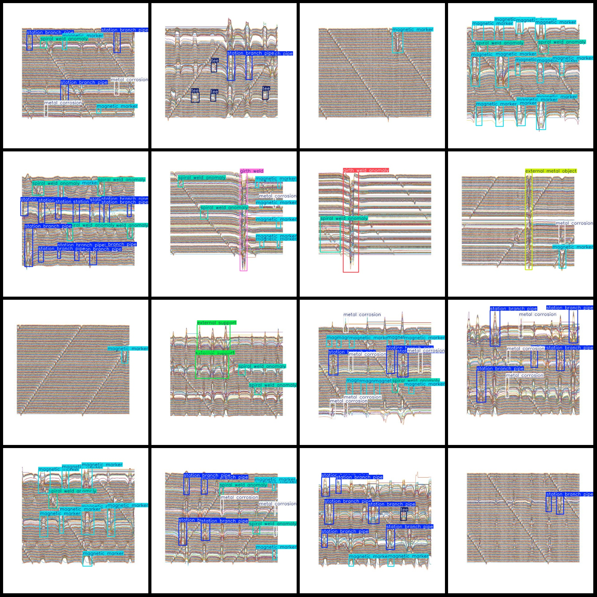
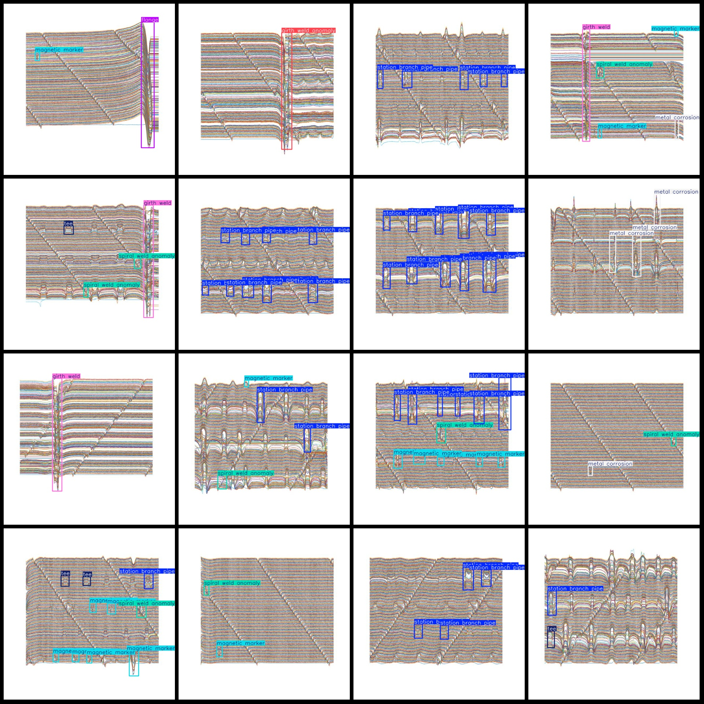

# Intelligent Industrial Tire X-ray Image Metal and Structural Defect Detection Dataset VOC+YOLO Format, 896 Categories

Dataset format: Pascal VOC format + YOLO format (txt files without split paths, only containing jpg images and corresponding VOC format xml files and yolo format txt files)
Number of images (jpg file count): 896
Number of labels (xml file count): 896
Number of labels (txt file count): 896
Number of label categories: 11
Label category names (note that the order of labels in the yolo format does not correspond with this, but rather based on the classes.txt in the labels folder): ["casing", "external metal object", "external support", "flange", "girth weld", "girth weld anomaly", "magnetic marker", "metal corrosion", "spiral weld"]
anomaly","station branch pipe","tee"]  
The number of bounding boxes per category is:
- Casing : 3
- External metal object : 33
- External support : 20
- Flange : 4
- Girth weld : 153
- Girth weld anomaly : 118
- Magnetic marker : 1345
- Metal corrosion : 1235
- Spiral weld anomaly : 470
- Station branch pipe : 1692
- Tee : 255
Total bounding boxes: 5328

The number of images per category is:
- Casing : 3
- External metal object : 27
- External support : 15
- Flange : 4
- Girth weld : 151
- Girth weld anomaly : 114
- Magnetic marker : 455
- Metal corrosion : 301
- Spiral weld anomaly : 274
- Station branch pipe : 415
- Tee : 128
Image resolution: 640x640
Labeling tool used: labelImg
Labeling rules: Draw bounding boxes for the categories
Important note: The dataset does not have a training/validation/test split; it needs to be manually divided.
Special declaration: This dataset does not guarantee any accuracy in the trained models or weight files.
Image previews:

Here is a pay link on Stripe ( https://buy.stripe.com/3cs8yP7sY87d0vu9AB ). Please contact me lonlonago@foxmail.com after funding $89, and I will send you a complete data files , thank you!

